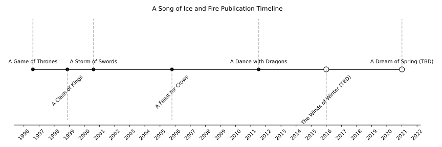
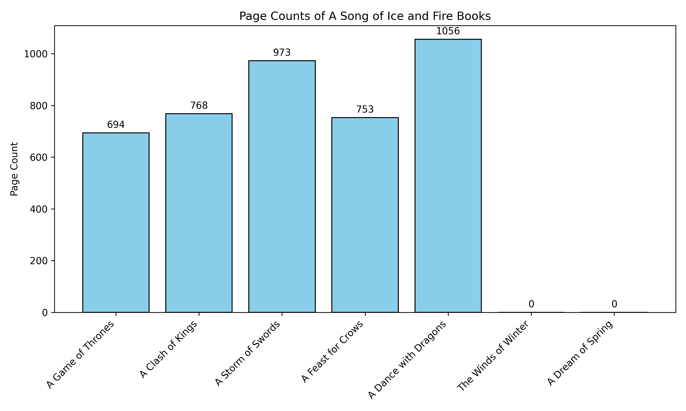

# All Book Covers & Graphs

Welcome to the collection of canonical books for A Song of Ice and Fire. This page highlights covers, timelines, and statistics for the main series.
*Legal note: Book covers shown here are provided by contributors or are placeholders. They are intended for reference and review under fair use. Copyright of the original artwork belongs to their respective publishers and artists.*

## Covers Grid


## Publication Timeline



## Page Counts



## Books

### A Game of Thrones

* **Title:** A Game of Thrones
* **Year:** 1996
* **Pages:** 694
* **License:** contributor-provided
* **Note:** Book 1
* [View Full Cover](../archive/books/book-covers/a-game-of-thrones__cover_placeholder.png)

### A Clash of Kings

* **Title:** A Clash of Kings
* **Year:** 1998
* **Pages:** 768
* **License:** contributor-provided
* **Note:** Book 2
* [View Full Cover](../archive/books/book-covers/a-clash-of-kings__cover_placeholder.png)

### A Storm of Swords

* **Title:** A Storm of Swords
* **Year:** 2000
* **Pages:** 973
* **License:** contributor-provided
* **Note:** Book 3
* [View Full Cover](../archive/books/book-covers/a-storm-of-swords__cover_placeholder.png)

### A Feast for Crows

* **Title:** A Feast for Crows
* **Year:** 2005
* **Pages:** 753
* **License:** contributor-provided
* **Note:** Book 4
* [View Full Cover](../archive/books/book-covers/a-feast-for-crows__cover_placeholder.png)

### A Dance with Dragons

* **Title:** A Dance with Dragons
* **Year:** 2011
* **Pages:** 1056
* **License:** contributor-provided
* **Note:** Book 5
* [View Full Cover](../archive/books/book-covers/a-dance-with-dragons__cover_placeholder.png)

### The Winds of Winter

* **Title:** The Winds of Winter
* **Year:** TBD
* **Pages:** 0
* **License:** contributor-provided
* **Note:** Book 6
* [View Full Cover](../archive/books/book-covers/the-winds-of-winter__cover_placeholder.png)

### A Dream of Spring

* **Title:** A Dream of Spring
* **Year:** TBD
* **Pages:** 0
* **License:** contributor-provided
* **Note:** Book 7
* [View Full Cover](../archive/books/book-covers/a-dream-of-spring__cover_placeholder.png)

## How to regenerate
You can regenerate the graphics and timelines by running the following CLI command from the root of the repository:

```bash
python3 scripts/generate-book-graphics.py --metadata archive/books/metadata/books_metadata.yml --out docs/graphs/
```
